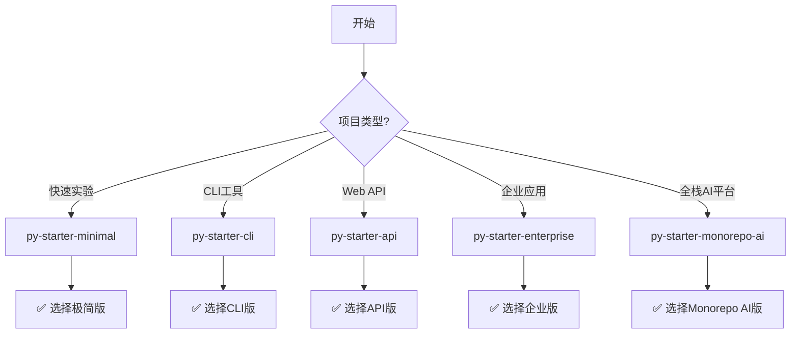

# Wanderer's Python Project Starters

[](https://github.com/cookiecutter/cookiecutter)
[](https://opensource.org/licenses/MIT)

这是一个由 `wanderer99176` 创建和维护的、用于快速启动高质量Python项目的 [Cookiecutter](https://github.com/cookiecutter/cookiecutter) 模板库。

本仓库采用 Monorepo 模式，集中管理了适用于不同规模和场景的项目启动器，旨在将现代Python开发的最佳实践固化为可复用的脚手架。

## ✨ 核心理念与特性

所有启动器均遵循以下现代、高效的开发理念：

  * **现代化工具链**: 完全由 `pyproject.toml` 驱动，使用 `uv` 进行极致性能的环境和包管理。
  * **最佳实践结构**: 采用 `src` 布局（Minimal版除外），从根源上避免常见的Python导入问题。
  * **自动化与质量保证**: 内置 `Ruff` 进行代码格式化与检查，集成 `pytest` 进行测试，并提供了开箱即用的 `pre-commit` 钩子和 GitHub Actions CI/CD 工作流。
  * **可扩展性**: 提供了从快速原型到大型企业级应用的多种启动器，可以随项目的成长而平滑演进。
  * **容器化就绪**: 中型及以上规模的启动器均包含经过优化的 `Dockerfile`，为云原生部署做好了准备。

## 📦 启动器概览 (Available Starters)

本仓库目前包含以下项目启动器：

| 启动器名称 | 描述与适用场景 | 核心特性 | 最佳用途 |
| :--- | :--- | :--- | :--- |
| `py-starter-minimal` | **极简版**: 用于快速原型、一次性脚本或个人实验 | 单文件、即开即用 | 💡 快速验证想法 |
| `py-starter-cli` | **CLI工具版**: 开发可分发的命令行工具或功能库 | src布局、测试框架、打包配置 | 🔧 命令行工具 |
| `py-starter-api` | **API服务版**: 构建RESTful API或Web应用 | FastAPI、Docker、CI/CD | 🌐 Web API服务 |
| `py-starter-enterprise` | **企业级版**: 大型、多人协作、长期维护的项目 | 完整架构、分层设计、文档齐全 | 🏢 企业级应用 |
| `py-starter-monorepo-ai` | **🔥 全栈AI Monorepo**: 企业级全栈AI应用完整解决方案 | Monorepo、微服务、AI集成、K8s | 🚀 全栈AI平台 |

## 🚀 快速开始

### 前置要求

请确保您已经安装了 `cookiecutter` 命令行工具。

```bash
# 推荐使用 pipx
pipx install cookiecutter
```

### 选择并创建项目

根据您的项目需求，选择并运行以下对应命令：

---

#### 1️⃣ **极简版 (Minimal)** - 快速原型

适合：个人实验、一次性脚本、学习Demo

```bash
cookiecutter gh:wanderer99176/code-template --directory py-starter-minimal
```

**特点**：
- ⚡ 极速启动，几乎零配置
- 📄 单文件结构，简单直接
- 🎯 专注于快速验证想法

---

#### 2️⃣ **CLI工具版 (CLI)** - 命令行工具

适合：可分发的CLI工具、小型功能库

```bash
cookiecutter gh:wanderer99176/code-template --directory py-starter-cli
```

**特点**：
- 🏗️ 标准src布局
- ✅ 集成pytest测试框架
- 📦 完整的打包配置
- 🔧 适合发布到PyPI

---

#### 3️⃣ **API服务版 (API)** - Web应用

适合：RESTful API、Web服务、中型应用

```bash
cookiecutter gh:wanderer99176/code-template --directory py-starter-api
```

**特点**：
- 🚀 FastAPI框架
- 🐳 Docker支持
- 🔄 GitHub Actions CI/CD
- 📊 API文档自动生成

---

#### 4️⃣ **企业级版 (Enterprise)** - 大型项目

适合：大型项目、团队协作、长期维护

```bash
cookiecutter gh:wanderer99176/code-template --directory py-starter-enterprise
```

**特点**：
- 🏢 完整的分层架构
- 📁 清晰的目录结构
- 📚 详尽的文档模板
- 🔐 安全最佳实践
- 👥 团队协作配置

---

#### 5️⃣ **全栈AI Monorepo版 (Monorepo AI)** - 终极解决方案 🔥

适合：企业级全栈AI应用、微服务架构、云原生部署

```bash
cookiecutter gh:wanderer99176/code-template --directory py-starter-monorepo-ai
```

**核心特性**：
- 🏗️ **Monorepo架构**: pnpm workspace + Turbo 统一管理
- 🐍 **后端服务**: FastAPI + SQLModel + Alembic + Redis + ARQ
- 🎨 **前端应用**: Nuxt 3 + TypeScript + Nuxt UI + Tailwind CSS
- 🤖 **AI服务**: YOLOv8目标检测 + Whisper语音识别
- 🕷️ **爬虫服务**: Scrapy分布式爬虫
- 🐳 **DevOps**: Docker Compose + Kubernetes + Helm + OpenTofu
- 📊 **监控体系**: Prometheus + Grafana + Loki + Jaeger
- 🔒 **安全扫描**: Trivy + Dependabot
- 🔄 **CI/CD**: GitHub Actions完整流水线
- 📝 **文档完整**: 环境搭建、部署手册、ADR

**创建后的步骤**：

```bash
# 1. 进入项目目录
cd <your-project-name>

# 2. 运行自动化设置脚本
bash scripts/setup.sh

# 3. 启动开发环境
pnpm dev
```

详细文档：查看项目内的 `使用指南.md`

---

## 📊 启动器功能对比

| 功能特性 | Minimal | CLI | API | Enterprise | Monorepo AI |
|:---|:---:|:---:|:---:|:---:|:---:|
| **项目结构** | 扁平 | src布局 | src布局 | 分层架构 | **Monorepo** |
| **依赖管理** | pyproject.toml | uv | uv | uv | **pnpm + uv** |
| **测试框架** | ❌ | ✅ | ✅ | ✅ | **✅ 多框架** |
| **代码规范** | ❌ | Ruff | Ruff | Ruff + pre-commit | **Ruff + ESLint** |
| **CI/CD** | ❌ | ❌ | ✅ | ✅ | **✅ 完整流水线** |
| **Docker** | ❌ | ❌ | ✅ | ✅ | **✅ Compose + K8s** |
| **数据库** | ❌ | ❌ | 可选 | ✅ | **✅ PostgreSQL + Redis** |
| **API框架** | ❌ | ❌ | FastAPI | FastAPI | **FastAPI + Nuxt** |
| **前端支持** | ❌ | ❌ | ❌ | ❌ | **✅ Nuxt 3** |
| **AI集成** | ❌ | ❌ | ❌ | ❌ | **✅ YOLOv8 + Whisper** |
| **监控** | ❌ | ❌ | ❌ | 基础 | **✅ 完整监控栈** |
| **文档** | 基础 | README | 完整 | 详尽 | **✅ 企业级文档** |
| **适用规模** | 个人实验 | 小工具 | 中型项目 | 大型项目 | **企业级平台** |
| **启动速度** | ⚡⚡⚡ | ⚡⚡ | ⚡ | ⚡ | ⚡ |
| **学习曲线** | 简单 | 简单 | 中等 | 中等 | 较陡 |

## 💡 如何选择合适的启动器？



### 决策指南

**选择 `py-starter-minimal`** 如果你：
- 💡 需要快速验证一个想法
- 📝 写一个简单的脚本或Demo
- 🎓 学习Python基础
- ⏱️ 希望在5分钟内开始编码

**选择 `py-starter-cli`** 如果你：
- 🔧 开发命令行工具
- 📦 计划发布到PyPI
- ✅ 需要完整的测试框架
- 🏗️ 想要标准的项目结构

**选择 `py-starter-api`** 如果你：
- 🌐 构建RESTful API
- 🚀 开发Web服务
- 🐳 需要Docker部署
- 📊 需要自动API文档

**选择 `py-starter-enterprise`** 如果你：
- 🏢 大型企业项目
- 👥 多人团队协作
- 📚 需要完整文档规范
- 🔒 重视安全和规范

**选择 `py-starter-monorepo-ai`** 如果你：
- 🚀 构建全栈AI应用
- 🏗️ 需要微服务架构
- 🤖 集成机器学习功能
- ☸️ 云原生部署
- 📊 需要完整监控体系

## 🔄 项目升级路径

```
Minimal → CLI → API → Enterprise → Monorepo AI
  ↓       ↓      ↓        ↓            ↓
 实验    工具   服务    企业应用    AI平台
```

项目可以随着需求增长，逐步迁移到更高级的启动器。

## 🛠️ 本地使用（无需网络）

如果您已经克隆了本仓库，可以直接使用本地路径：

```bash
# 使用本地启动器
cookiecutter /path/to/code-template/py-starter-minimal
cookiecutter /path/to/code-template/py-starter-cli
cookiecutter /path/to/code-template/py-starter-api
cookiecutter /path/to/code-template/py-starter-enterprise
cookiecutter /path/to/code-template/py-starter-monorepo-ai
```

## 📚 相关资源

### 官方文档
- [Cookiecutter 文档](https://cookiecutter.readthedocs.io/)
- [uv 快速入门](https://github.com/astral-sh/uv)
- [Ruff 配置指南](https://docs.astral.sh/ruff/)
- [FastAPI 文档](https://fastapi.tiangolo.com/)
- [Nuxt 3 文档](https://nuxt.com/)
- [Turborepo 指南](https://turbo.build/repo)

### 最佳实践
- [Python 打包指南](https://packaging.python.org/)
- [十二因素应用](https://12factor.net/zh_cn/)
- [语义化版本](https://semver.org/lang/zh-CN/)

## 🔧 模板的维护与贡献

本启动器库是一个持续演进的项目。当发现有可以改进的最佳实践时，可以直接修改本仓库中的模板文件并提交。

欢迎通过以下方式参与：
- 🐛 [报告问题](https://github.com/wanderer99176/code-template/issues)
- 💡 [提出建议](https://github.com/wanderer99176/code-template/discussions)
- 🔀 [提交PR](https://github.com/wanderer99176/code-template/pulls)

## 📜 许可证

本模板库本身采用 [MIT License](LICENSE) 开源。

使用这些启动器生成的项目，其许可证由您在创建时选择决定。

---

<div align="center">

**⭐ 如果这个项目对您有帮助，欢迎 Star！**

Made with ❤️ by [wanderer99176](https://github.com/wanderer99176)

[Report Bug](https://github.com/wanderer99176/code-template/issues) · [Request Feature](https://github.com/wanderer99176/code-template/issues) · [Discussions](https://github.com/wanderer99176/code-template/discussions)

</div>
